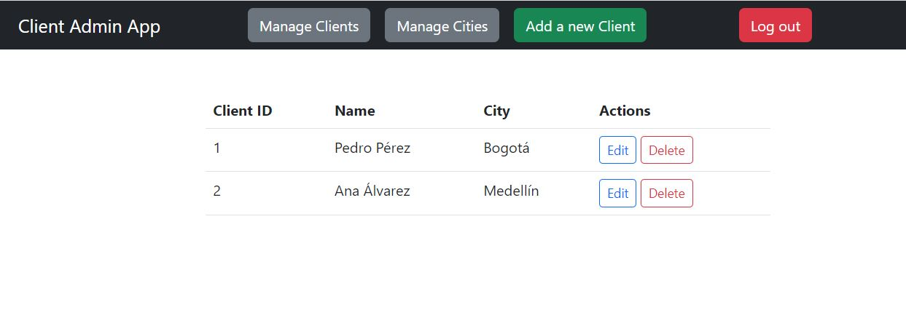
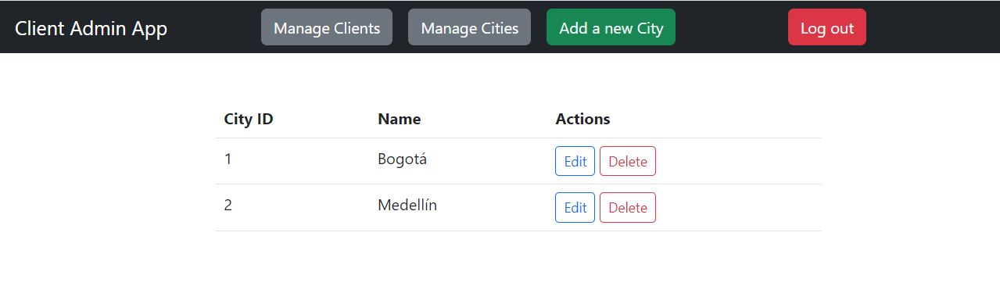
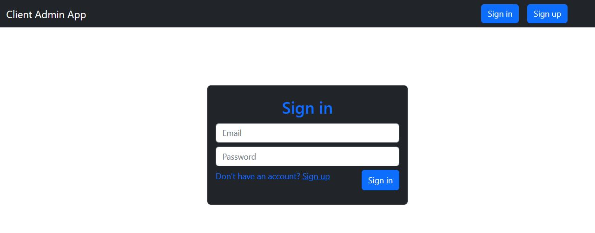

# Client Admin App

Welcome to Client Admin App! This app is designed to help you manage customers by city. It has several features to help you do this, including the ability to create, read, update, and delete clients and cities. Also, the app has a login, so only authorized users can see or modify the data.

## Preview

**Clients view**



**Cities view**



**Sign in view**



## Built With

- Ruby v2.7.4
- Ruby on Rails v6.1.6
- Bootstrap 5.2.3

## Getting Started

To get a local copy up and running follow these simple steps.

### Prerequisites

Ruby: 2.7.4
Rails: 6.1.6
Postgres: >=9.5

### Setup

Install gems with:

```
bundle install
```

Setup database with:

```
   rails db:create
   rails db:migrate
   rails db:seed
```

### Usage

Start server with:

```
    rails server
```

Open `http://localhost:3000/` in your browser.

### Run tests

```
    RSpec --format documentation
```

## Author

**John Arboleda**
- GitHub: [@John-Arboleda](https://github.com/John-Arboleda)
- Twitter: [@John_J_Arboleda](https://twitter.com/John_J_Arboleda)
- LinkedIn: [@john-arboleda](https://www.linkedin.com/in/john-arboleda/)

## 🤝 Contributing

Contributions, issues and feature requests are welcome!

Feel free to check the [issues page](issues/).

## Show your support

Give a ⭐️ if you like this project!